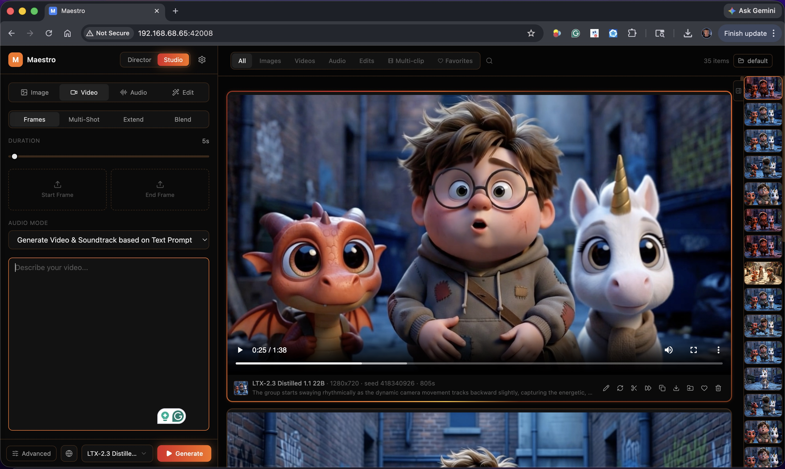

# MuseForge

A one-click AI **video, image, and audio studio** for creators. MuseForge pairs a modern React UI with a powerful generation backend and adds a **Director mode** that uses an LLM to plan music videos and short films from a single prompt. Optimized for the latest LTX-2.3 models & LoRAs, with support for virtually all open weight models.  



## What it does

### 🎬 Director Mode — automatic music videos and short films
The flagship feature. Drop in an audio track or write a story; a local LLM plans every shot, writes screenplays/lyrics, generates start frames & keyframes with character consistency, polishes prompts per model & LoRA-specific prompting guides, and runs the full multi-clip generation. Two skills:

- **Music Video** — beat-aware shot planning aligned to your audio. The LLM analyzes BPM, sections (verse/chorus/bridge), and energy, then writes shots that hit the downbeats. Speaker transcription & diarization lets you name and target different voices or singers.
- **Short Film** — screenplay-driven scenes with named characters, dialogue, and continuity across cuts. Pacing-bias slider controls cut frequency.
  
- **Auto Mode** runs the entire pipeline end-to-end (analyze → plan → generate images → generate clips → combine). Manual mode lets you review and edit at every step.
- **Director v2 architecture** with structured shot planning, mode-specific prompt renderers, and a 3-pass refinement (screenplay → shot breakdown → per-model polish). Director v2 optimizes what the LLM is being asked to do across several passes, with each pass optimizing the LLM request for creativity (when writing the screenplay), structured outputs (when outputting JSON), and prompt refinement, which injects LoRA prompting guides into the context.  

### ⚡ Performance Auto-Tune — zero-config setup
Detects your GPU, VRAM, and RAM on first launch and picks the right profile, quantization, VAE tiling, and VRAM safety coefficient. No more "Profile 1 vs 2 vs 4.5" guesswork. Power users still have full manual control under "Show advanced settings."

- **OOM recovery banner** auto-suggests lowering the VRAM headroom when a generation runs out, with one-click apply.
- **Live download status** during model setup ("Downloading transcription model (first use downloads ~300MB)..." instead of a vague spinner).

### 🎨 Studio Mode — full manual control
Direct access to every model and every knob:
- **Video** — LTX-2.3, Wan1/2, Hunyuan, and many more.
- **Image** — Flux 2 Klein 9B (default), Qwen Image Edit, and many more
- **Audio** — TTS: Kugelaudio, Qwen3 TTS. Music: ACE-Step. SFX: MMAudio
- **Multi-clip generation** with per-clip prompts, seamless overlapping (sliding window) transitions, and shared LoRAs
- **Blend video Mode** Remember Sora 1 blend mode, where you could overlap two videos, and use AI to blend them together? 
- **Frames Injection (KFI)** for character continuity in long videos
- **Sliding window** for arbitrarily long generations
- **Spatial upsampling, film grain, codec selection** as post-processing options

### 🤖 Local LLM — built-in, no setup
MuseForge auto-downloads `llama-server` (~600 MB one-time) and your chosen GGUF model on first use. Defaults to **Gemma 4 4B (Recommended)** — fast, capable, and runs comfortably on smaller GPUs. Auto-detects CUDA and binds the LLM to GPU when available.

- Pre-curated registry: Gemma 4 (2B / 4B / 26B MoE / 31B) and Qwen3.6 27B — uncensored/abliterated instruct variants tuned for creative prompting
- **External providers** also supported: OpenAI, Anthropic, custom OpenAI-compatible endpoints (currently experimental)
- **Vision support** so LLMs can enhance prompting based on reference images
- Auto-unloads after 60s idle to free VRAM for video gen

### 🛒 Built-in CivitAI LoRA browser
- Search, filter, and one-click install any LoRA from CivitAI without leaving MuseForge
- **LoRA update detection** — Check button refreshes from CivitAI, shows update badges on outdated LoRAs
- **My LoRAs view** with filters for Updates and direct uninstall
- **AI-generated LoRA prompting guides** Helps remove the guesswork from LoRAs. AI generates LoRA guides when LoRA is downloaded based on CIVITAI and HuggingFace repos. The guides explain what each LoRA does and how to use it, provide prompt examples, and recommend weight settings that are automatically applied when LoRA is selected. 
- **Recommended weight ranges** (sourced from CivitAI sidecars, HuggingFace, or fallback heuristics) shown directly on the weight sliders
- **Multi-LoRA pack auto-extraction** for archives that bundle several LoRAs

### 🎭 Themes
Three theme families, each with a dark and a light variant, switchable in Settings → System:
- **Golden Hour** (default) — warm cinematic palette with sunset-gradient CTAs and spotlight bezels; warm paper with burnt orange in daylight
- **Classic** — the original cool charcoal palette with blue accents; cool paper in daylight
- **Onyx** — minimalist monochrome, pure black with neutral grey surfaces; white and grey in daylight

Appearance mode is **Dark / Light / Auto** — Auto follows your system's appearance and switches live when it changes.

### 🛠️ Edit Mode *(experimental)*
- **Retake** — re-roll a section of an existing video with a new prompt
- **Outpaint** — extend a video's frame in any direction
- **Edit Anything** — allows users to modify, add, or remove elements from existing videos using text prompts and In-Context LoRA (IC-LoRA) models

### 📂 Workspaces
Multiple isolated output directories with a quick switcher in the sidebar. Useful for separating client projects, NSFW vs SFW, or experiments. Pinned and favorited outputs are tracked per workspace.

### 🔒 Mature mode + experimental gate
- **NSFW mode** is opt-in with a disclaimer step. Disabled by default. Gates uncensored model variants, NSFW LoRAs in the CivitAI browser, and the Settings → Services NSFW toggle.
- **Experimental features gate** hides power-user toggles (external API keys, Voice Reference, Inpaint, Restyle, Wan2GP Enhancer) by default for a focused first-launch experience.

### 📊 Director Pipeline Dashboard
View all past Director runs with their full state — clip plans, generated images, generated clips, polish diffs. Re-run any clip without re-running the whole pipeline.

## Updates

See [CHANGELOG.md](CHANGELOG.md) for the full release history.

## Requirements

| | Minimum | Recommended |
|---|---|---|
| **OS** | Windows 10/11 or Linux | Windows 11 |
| **GPU** | NVIDIA, 6 GB VRAM | NVIDIA RTX 3090 / 4090 / 5090, 24 GB+ VRAM |
| **System RAM** | 16 GB | 32 GB+ |
| **Disk space** | **150 GB free** | **500 GB free** (for full model collection) |
| **Python** | 3.10 (manual install only — the Docker image bundles everything) | — |

**What to expect by GPU** (rough ballpark — varies with model, resolution, and length):

| Your card | First run | A short clip after models are cached |
|---|---|---|
| **24 GB** (3090 / 4090 / 5090) | smooth — everything runs | ~1–3 min |
| **12–16 GB** (3060 12GB / 4070 / 4080) | good — auto-tune picks an offload profile | ~4–10 min |
| **6–8 GB** | works, but expect heavy offloading | slow; stick to short/low-res clips |

The first video is always the slow one: install is ~10–20 min, then the first generation on each model downloads its weights (the default video model is ~18 GB). After that, weights are cached and only generation time applies. MuseForge's auto-tune sizes the settings to your card on first launch so you don't have to.

> ⚠ **AMD GPUs and macOS are not currently supported.** The pipeline depends on CUDA and several NVIDIA-only kernels. MacOS support is in development.  

> ⚠ **Model downloads are large.** A typical install pulls **50–100 GB** of model weights on first launch. The full collection can exceed **300 GB**. Make sure you have headroom on the drive holding the Docker volumes (or the checkout, for manual installs). However, only models requested during generation will be downloaded. 

## Install

### Docker (recommended)

Requirements: [Docker](https://docs.docker.com/engine/install/) and the [NVIDIA Container Toolkit](https://docs.nvidia.com/datacenter/cloud-native/container-toolkit/latest/install-guide.html).

```bash
git clone https://github.com/OWNER/MuseForge.git
cd MuseForge
docker compose up -d
```

Then open <http://localhost:7860>. The compose file pulls the prebuilt image from GHCR; uncomment `build: .` to build locally instead. The image is compiled for CUDA compute capabilities 8.0/8.6/8.9 (A100, RTX 30xx/40xx) by default — for other cards rebuild with e.g.:

```bash
docker build --build-arg CUDA_ARCHITECTURES="8.6;8.9;12.0" -t museforge .
```

All state (model weights, LoRAs, outputs, settings) lives in named Docker volumes — see [docker-compose.yml](docker-compose.yml). The first generation on each model triggers a one-time weight download.

### Manual install (Linux / Windows)

```bash
git clone https://github.com/OWNER/MuseForge.git
cd MuseForge

# Python env (3.10)
python3.10 -m venv app/env
source app/env/bin/activate          # Windows: app\env\Scripts\activate
pip install torch==2.10.0+cu128 torchvision==0.25.0+cu128 torchaudio==2.10.0+cu128 --index-url https://download.pytorch.org/whl/cu128
pip install -r app/requirements.txt

# Optional: SageAttention for faster attention kernels (see Dockerfile for the build recipe)

# Voice conversion component (GPL-3.0, lives in its own repo)
git clone --depth 1 --branch v1.0.0 https://github.com/Blizaine/maestro-seedvc app/postprocessing/seedvc

# React UI
cd ui && npm install && npm run build && cd ..

# Run
cd app && python launch.py
```

### Updating

Docker: `docker compose pull && docker compose up -d`. Manual: `git pull`, re-run `pip install -r app/requirements.txt` and the UI build.

### Resetting

Docker: `docker compose down` and remove the volumes you want to reset (`docker volume ls | grep museforge`). Model weights live in the `ckpts` volume — leave it alone unless you want to re-download 50+ GB.

## Usage

Open the web UI (default <http://localhost:7860>).

- **Sidebar** — mode toggle (Studio / Director), model picker, prompt, LoRAs, advanced settings
- **Main feed** — generated outputs, dashboard, Director pipeline status
- **Settings drawer** (gear icon) — model visibility, performance auto-tune, services (LLM, API keys, NSFW, theme)

## Inpaint (SAM 3.1) — experimental

The Edit-mode Inpaint feature needs a separate SAM 3.1 segmentation service that is **not bundled** (it requires its own Python 3.12 environment and several GB of extra dependencies, and is currently unsupported in the Docker image). To set it up on a manual install: create a Python 3.12 venv at `app/services/sam/env` and install `app/services/sam/requirements.txt` into it — the backend starts the service on demand. All other features work without it.

## Sharing on the local network

The server binds to `127.0.0.1` by default; set the `SERVER_NAME` environment variable to `0.0.0.0` for LAN access (`SERVER_PORT` picks the port). In Docker the container already binds `0.0.0.0` internally — control exposure via the compose port mapping (`127.0.0.1:7860:7860` for loopback-only). Note the API has no authentication; don't expose it to untrusted networks.

## Credits

MuseForge is built on top of, and indebted to, the following projects:

- [**Wan2GP / WanGP**](https://github.com/deepbeepmeep/Wan2GP) by [@deepbeepmeep](https://github.com/deepbeepmeep) — the entire generation pipeline. MuseForge inherits WanGP's non-commercial license.
- [**LTX-Video**](https://github.com/Lightricks/LTX-Video) by Lightricks — LTX-2 and LTX-2.3 distilled models.
- [**Wan 2.1 / 2.2**](https://github.com/Wan-Video/Wan2.1) by Alibaba — text-to-video and image-to-video.
- [**Flux**](https://github.com/black-forest-labs/flux) by Black Forest Labs — image generation.
- [**Qwen**](https://github.com/QwenLM/Qwen) by Alibaba — image generation and LLMs.
- [**Gemma**](https://ai.google.dev/gemma) by Google — Gemma 4 LLM (default for Director mode).
- [**SAM**](https://github.com/facebookresearch/sam2) by Meta — segmentation backbone for Inpaint.
- [**MMAudio**](https://github.com/hkchengrex/MMAudio) — automatic ambient audio generation.
- [**CivitAI**](https://civitai.com) — LoRA browser and weight recommendations.
- [**llama.cpp**](https://github.com/ggml-org/llama.cpp) — local LLM inference engine.
- [@cocktailpeanut](https://github.com/cocktailpeanut)'s original one-click Wan2GP launcher, from which this project's install flow originally derived.

## License

MuseForge is released under the **WanGP Non-Commercial Evaluation License 1.1**, inherited from the upstream Wan2GP project. See [LICENSE](LICENSE) for the summary and [app/LICENSE.txt](app/LICENSE.txt) for the full text.

**TL;DR**: free to use and modify for non-commercial purposes; the *outputs* you generate are yours to use commercially (with attribution); commercial use of the *software itself* (including hosted services and APIs) requires a separate commercial license from the WanGP licensor.

Third-party models, weights, and components keep their own licenses — review them before redistributing. Notably, the [seed-vc](https://github.com/Plachta/seed-vc) voice-conversion component is **GPL-3.0**, so it is distributed from its own repository ([Blizaine/maestro-seedvc](https://github.com/Blizaine/maestro-seedvc)) and cloned into `app/postprocessing/seedvc/` at image-build/install time rather than shipped in this tree. Other vendored components include BigVGAN (MIT), FlashVSR sparse-sage (Apache-2.0), and IndexTTS2 (bilibili model license).

## Issues

Bug reports and feature requests: use this repository's GitHub issues.
