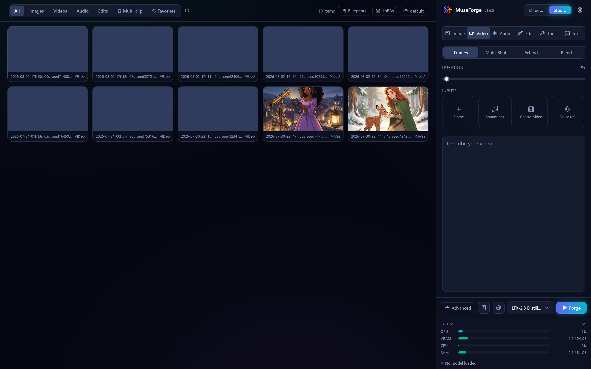
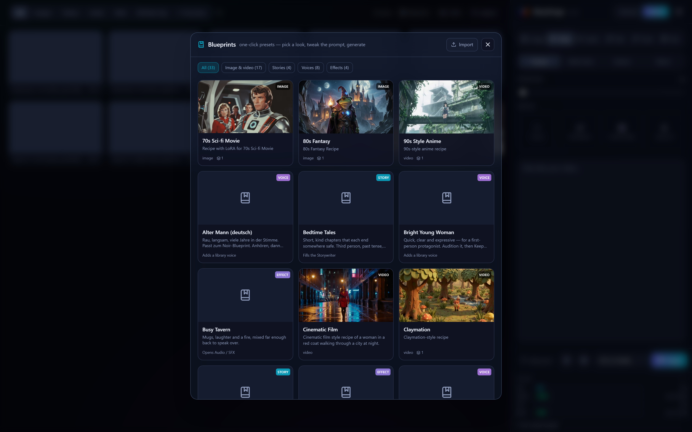
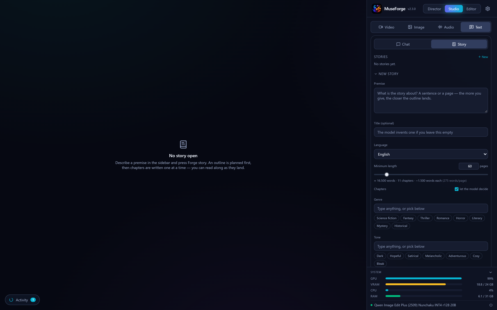
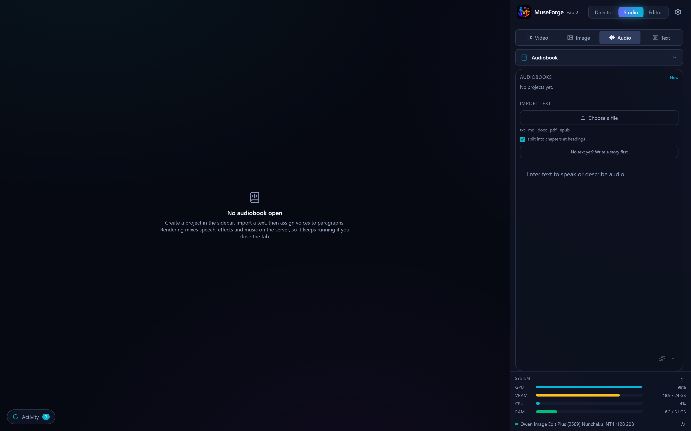
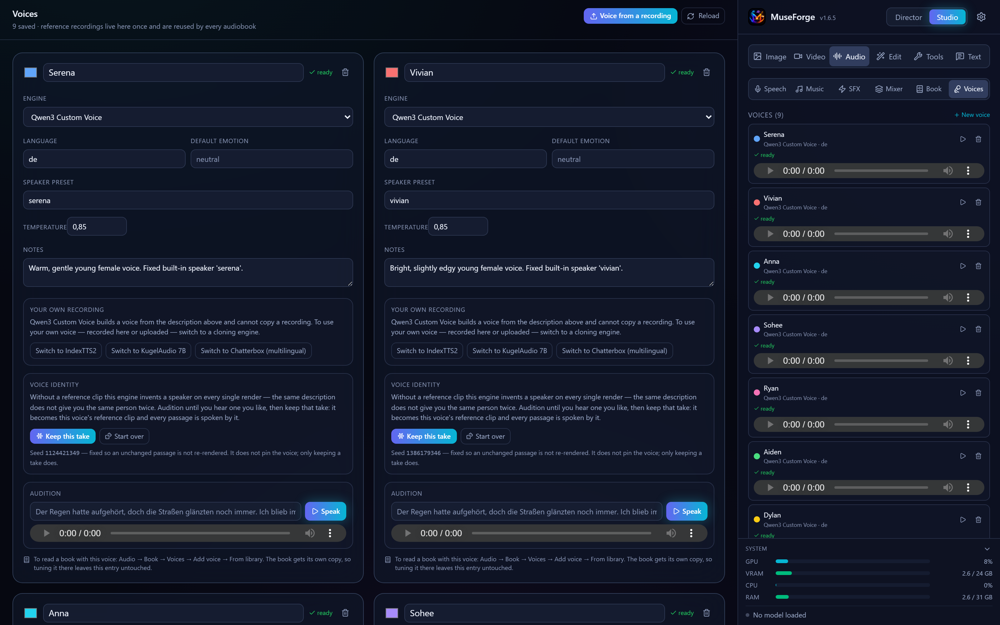
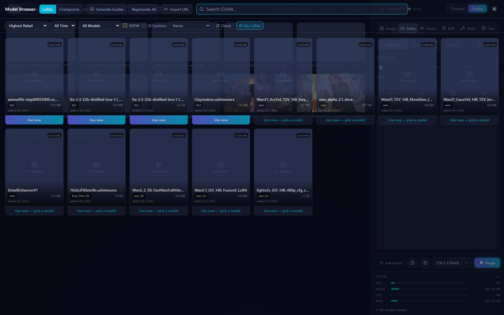

<p align="center">
  
</p>

<p align="center">
  <strong>Self-hosted AI media studio</strong> — video, images, audio, long-form text and audiobooks,<br />
  drivable from a browser, a script or an AI agent.
</p>

<p align="center">
  <a href="https://fgilde.github.io/MuseForge/">Website</a> ·
  <a href="https://fgilde.github.io/MuseForge/docs/">Documentation</a> ·
  <a href="docs/API.md">API &amp; MCP reference</a> ·
  <a href="https://gilde.org">gilde.org</a>
</p>

<p align="center">
  
</p>

[](https://quickrun.org/run?repo=fgilde/MuseForge)

---

> **Heritage:** MuseForge is a fork of [Maestro](https://github.com/Blizaine/Maestro) by
> [@Blizaine](https://github.com/Blizaine), which itself builds on the
> [Wan2GP](https://github.com/deepbeepmeep/Wan2GP) generation pipeline. Full credits
> [below](#credits) — this README covers what MuseForge does differently.
> The `VERSION` file tracks the upstream release the engine is level with
> (currently **Maestro 1.9.1**), so you can tell at a glance how current it is.

Deploy it anywhere with one `docker compose up`, then use it from the browser or
let an agent drive it over MCP. 197 generation models, an LLM-planned Director
mode, a long-form Storywriter and a full audiobook producer — one Docker image.

## Why a separate tool?

Maestro is a desktop-style app distributed through the Pinokio launcher, optimized
for the person sitting in front of it. MuseForge points the same generation engine
somewhere else — **infrastructure and long-form work instead of a desktop app**.

### Run it like a service

- **Docker-first.** One `docker compose up` on any CUDA box. No launcher, no Python
  setup, no per-machine install scripts. Prebuilt images ship from GHCR via CI, and
  all state (weights, LoRAs, outputs, settings) lives in named volumes.
- **Everything is an API.** 192 REST endpoints under `/api/v1` with interactive
  OpenAPI docs — the UI is a client, not the only way in.
- **Agents are first-class.** A native **MCP endpoint** at `/mcp` exposes **76
  tools**: list models, submit and poll jobs, fetch outputs, write a story, build an
  audiobook, manage voices and LoRAs. Optional bearer-token auth. An agent can be
  handed a document and return a finished audiobook without a human touching the UI.

### Do more than single clips

| | What it is |
|---|---|
| **Storywriter** | Novel-length prose in chapters, with outline, continuity checks between chapters, translation into 28 languages and an audit pass that reports characters, timeline and plot holes. |
| **Audiobook producer** | Import a document, split it into passages, give each one a voice and an emotion, mix in effects with ducking and loudness matching, render chapters or a chaptered M4B. Renders are cached per passage, so an edit re-voices only what changed. |
| **Voice library** | Reusable voices across four TTS engines. Build one from a description and keep the take you like, or **adopt your own recording** as a cloning reference. |
| **Blueprints** | 33 shipped recipes across five kinds — Image, Video, Story, Voice and Effect. Save any output's full recipe and re-apply it in one click. |
| **LoRA workflow** | Browse CivitAI in-app, see what you already own, "Use now" wires a LoRA into the right model, and misfiled files can be relocated instead of silently never appearing. |
| **Workspaces** | Separate output folders per project, switchable from the header. |

### Fix what got in the way

- Failures say what went wrong instead of stopping quietly.
- Every long-running job — generations, story passes, **and downloads** — shows up in
  the activity panel and actually stops when you stop it.
- A multi-line prompt fans out into one job per line, so a six-scene blueprint
  produces six scenes.

If you want the original desktop experience with a one-click Pinokio install, use
[Maestro](https://github.com/Blizaine/Maestro). If you want to run the engine as a
service and integrate it, you're in the right place.

## Screenshots

| Director & Studio | Blueprints |
|---|---|
| [](docs/screenshots/studio.png) | [](docs/screenshots/blueprints.png) |
| Model, prompt, LoRAs and advanced knobs in the right-hand dock; the gallery keeps queue and results together. | Reusable recipes, labelled by kind — image, video, story, voice, effect. |

| Storywriter | Audiobook producer |
|---|---|
| [](docs/screenshots/storywriter.png) | [](docs/screenshots/audiobook.png) |
| Chapters, premise, outline and per-chapter regeneration. | Passages, voices per speaker, effects, chapter rendering. |

| Voice library | LoRA browser |
|---|---|
| [](docs/screenshots/voices.png) | [](docs/screenshots/lora-browser.png) |
| Engines, seeds, auditioning, and your own recordings as references. | CivitAI search with ownership, compatibility and one-click use. |

Retake them any time against a running instance:
`python scripts/capture_screenshots.py`.

## Quick start (Docker)

Requirements: [Docker](https://docs.docker.com/engine/install/) with the
[NVIDIA Container Toolkit](https://docs.nvidia.com/datacenter/cloud-native/container-toolkit/latest/install-guide.html),
an NVIDIA GPU (6 GB+ VRAM), and disk headroom for model weights (50–300 GB).

```bash
git clone https://github.com/fgilde/MuseForge.git
cd MuseForge
docker compose up -d
```

Open <http://localhost:7861>. The compose file builds locally by default; switch to
the prebuilt `ghcr.io/fgilde/museforge:latest` image by swapping two lines in
[docker-compose.yml](docker-compose.yml). Port 7861 is deliberate — a Maestro
instance on the same machine keeps 7860, so both can run side by side.

Build notes:

- Default image targets CUDA compute capabilities 8.0/8.6/8.9 (A100, RTX 30xx/40xx).
  Other cards: `docker build --build-arg CUDA_ARCHITECTURES="8.6;8.9;12.0" -t museforge .`
- Compiling the bundled SageAttention kernels needs ~8 GB RAM per job
  (`MAX_JOBS=2` default). On RAM-limited builders skip them — the app falls back to
  sdpa attention: `docker build --target runtime -t museforge:latest . && docker compose up -d --no-build`
- **The published GHCR image is the `runtime` target**, i.e. without
  SageAttention. Building both stages needs the CUDA devel image plus a second
  torch install in parallel, which does not fit a hosted runner's disk. The
  image is fully functional either way; run the *Docker image* workflow
  manually with "Also compile the SageAttention kernels" to publish a
  `:latest-sage` variant.
- The first generation on each model downloads its weights (the default video model
  is ~18 GB); only requested models are fetched.

**NAS app stores.** Each store reads its package from a fixed place, so that is
where they sit: [`templates/museforge.xml`](templates/museforge.xml) plus
`ca_profile.xml` for **Unraid**, [`gilde-museforge/`](gilde-museforge/) beside
`umbrel-app-store.yml` for **Umbrel**, and [`store/casaos/`](store/casaos/) and
[`store/cosmos/`](store/cosmos/) for **CasaOS** and **Cosmos**. Read
[packaging/README.md](packaging/README.md) first — the GHCR package has to be
public before any of them can install anything, and every one of them needs an
NVIDIA GPU on the host, which is why none of these are submitted to the stores
themselves.

Manual (non-Docker) install: Python 3.10 venv + torch 2.10/cu128 +
`app/requirements.txt`, clone the seed-vc component, build `ui/`, run
`python launch.py` — the [Dockerfile](Dockerfile) is the executable reference for
the exact steps.

## Using it

- **Studio** — direct control: pick a model (LTX-2.5, Wan, Hunyuan, Flux, Qwen,
  MiniMax H3, MiniMax-Music3, SCAIL-2, ACE-Step, TTS, …), prompt, LoRAs, advanced
  knobs, hit **Forge**. Work can be queued and held instead of started at once.
- **Director** — describe a music video or short film; a local LLM plans shots,
  writes prompts per model, generates start frames and runs the full multi-clip
  pipeline.
- **Text → Story** — premise to finished chapters, then translate, audit or hand the
  result straight to the audiobook producer.
- **Audio → Book / Voices** — build the voices, then read the book with them.
- **Blueprints / LoRAs** — buttons in the gallery header, reachable from anywhere.
- **Settings → API & MCP** — endpoint URL, ready-made client configs, tool reference
  and token status.

Full documentation: **<https://fgilde.github.io/MuseForge/docs/>**

## API & MCP

REST API at `/api/v1` (interactive docs: <http://localhost:7861/docs>), MCP endpoint
at <http://localhost:7861/mcp> (streamable HTTP):

```bash
claude mcp add --transport http museforge http://localhost:7861/mcp
```

Running it elsewhere? Use whatever address the UI answers on plus `/mcp` — not the
port the server binds internally. `GET /api/v1/mcp/info` reports the reachable URL,
whether a token is required, and a ready-made `claude mcp add` line.

Set `MUSEFORGE_API_TOKEN` (see docker-compose.yml) to require
`Authorization: Bearer <token>` on `/mcp`. Details: [docs/API.md](docs/API.md).

The API has no authentication beyond the optional MCP token and CORS is restricted
to localhost — control exposure via the compose port mapping
(`127.0.0.1:7861:7860` for loopback-only) and don't publish it to untrusted networks.

## Requirements

| | Minimum | Recommended |
|---|---|---|
| **GPU** | NVIDIA, 6 GB VRAM | RTX 3090 / 4090 / 5090, 24 GB+ |
| **RAM** | 16 GB | 32 GB+ |
| **Disk** | 150 GB free | 500 GB free |

AMD GPUs and macOS are not supported (CUDA-only pipeline). Performance auto-tune
profiles the GPU on first launch and picks offload/quantization settings; low-VRAM
cards work but generate slowly.

**Inpaint (SAM 3.1)** is experimental and not bundled in the Docker image — it needs
a separate Python 3.12 env at `app/services/sam/env` with
`app/services/sam/requirements.txt`. Everything else works without it.

## Updating / resetting

Docker: `docker compose pull && docker compose up -d` (or rebuild). Reset: remove the
named volumes you want to wipe (`docker volume ls | grep amazevideogen`) — model
weights live in `ckpts`, leave it unless you want to re-download.

**Pulling in upstream Maestro releases.** MuseForge has real git ancestry with
upstream, so this is an ordinary merge:

```bash
git remote add upstream https://github.com/Blizaine/Maestro.git   # once
git fetch upstream && git merge upstream/main
```

## License

MuseForge is released under the **WanGP Non-Commercial Evaluation License 1.1**,
inherited from upstream Wan2GP. See [LICENSE](LICENSE) and
[app/LICENSE.txt](app/LICENSE.txt). TL;DR: free for non-commercial use; your
generated *outputs* are yours (with attribution); commercial use of the software
itself needs a license from the WanGP licensor.

Third-party components keep their own licenses. The GPL-3.0
[seed-vc](https://github.com/Plachta/seed-vc) voice-conversion component is cloned
from its own repository at build time rather than vendored here.

## Credits

- [**Maestro**](https://github.com/Blizaine/Maestro) by [@Blizaine](https://github.com/Blizaine) — the direct upstream: Director mode, React UI foundation, LoRA tooling, auto-tune.
- [**Wan2GP / WanGP**](https://github.com/deepbeepmeep/Wan2GP) by [@deepbeepmeep](https://github.com/deepbeepmeep) — the entire generation pipeline.
- [**LTX-Video**](https://github.com/Lightricks/LTX-Video) (Lightricks), [**Wan 2.x**](https://github.com/Wan-Video/Wan2.1) (Alibaba), [**Flux**](https://github.com/black-forest-labs/flux) (Black Forest Labs), [**Qwen**](https://github.com/QwenLM/Qwen) (Alibaba), [**Gemma**](https://ai.google.dev/gemma) (Google) — models.
- [**SAM**](https://github.com/facebookresearch/sam2) (Meta), [**MMAudio**](https://github.com/hkchengrex/MMAudio), [**llama.cpp**](https://github.com/ggml-org/llama.cpp), [**CivitAI**](https://civitai.com) — segmentation, audio, local LLM inference, LoRA ecosystem.

## Issues

Bug reports and feature requests: this repository's GitHub issues.

---

<p align="center">
  Built by <a href="https://gilde.org">gilde.org</a>
</p>
